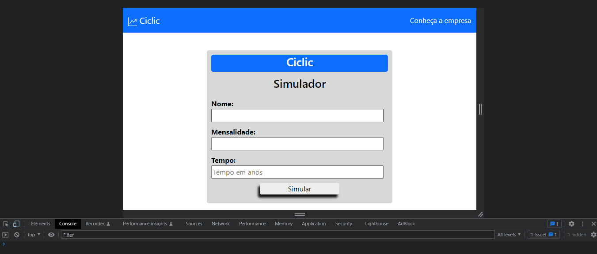

# Teste Front End da Ciclic Investimentos

O desafio pede que ao clicar em simular, deve ser feito um POST na api [http://api.mathjs.org/v4/](http://api.mathjs.org/), seguind o body dessa forma:
``` json
{ "expr": "20 * (((1 + 0.00517) ^ 24 - 1) / 0.00517)" }
```

A aplicação deve ser uma simulação de investimento utilizando juros composto. A aplicação terá duas telas (abaixo o resultado esperado pela empresa):


Para rodar a apresentação você deve copiar esse repositorio e abrir o arquivo 'index.html' no seu navegador. O resultado da apresentação em um gif:
<br>

